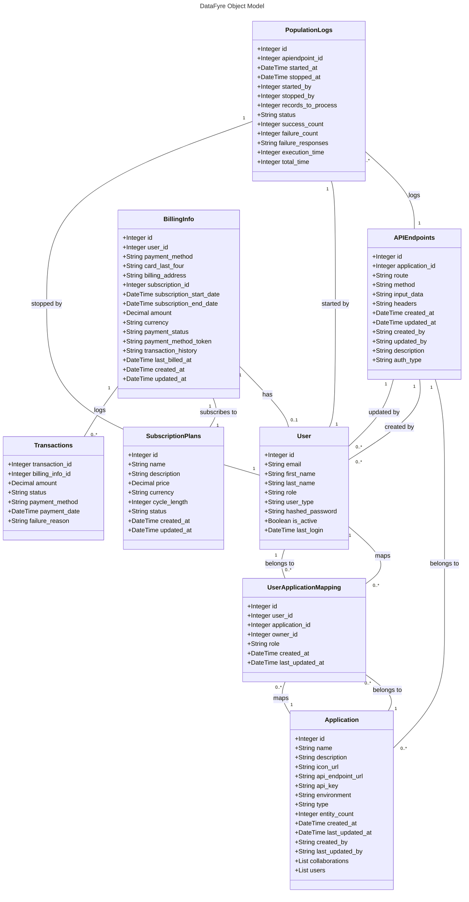

# DataFyre - Enterprise Data Generation and Management Tool

Welcome to **DataFyre**, the powerful and intuitive tool designed specifically for developers working with data-heavy applications. Created by the **DataSmiths** team, this project is the culmination of our efforts in the INFO6150 Web Design and User Experience course.

DataFyre leverages the **MERN stack** (MongoDB, Express.js, React, Node.js) to offer an enterprise-level solution for managing synthetic data. It allows developers to quickly generate, customize, and manage meaningful test data, track the status of population processes, and view detailed logs for more efficient testing and development workflows. Whether you're building an app from scratch or maintaining an existing one, DataFyre provides the tools to make your data management easier and more effective.

## Project Overview

In the world of modern development, data is critical for testing and development, especially when making frequent changes to applications. But generating real-world data can be time-consuming, costly, and impractical. **DataFyre** solves this problem by creating a fully customizable synthetic data generation tool with powerful analytics, dashboards, and user roles for enterprise-level management.

## Key Features

- **Synthetic Data Generation**: Automatically generate customizable, meaningful test data based on user-defined APIs and input formats.
- **Customizable Data**: Tailor the generated data to your application's specific needs, ensuring the data is realistic and useful.
- **Comprehensive Dashboard**: View an interactive, real-time dashboard with detailed insights, analytics, and population status.
- **Role-Based Access Control**: Manage user roles with different access levels and permissions (Admin, Developer, Tester, etc.), ensuring secure, scalable use in an enterprise setting.
- **Logs & Analytics**: Track every data generation event, view logs, and get insights into past populations for efficient debugging and testing.
- **Easy Integration**: Seamlessly integrate with your existing applications, allowing you to populate data whenever required for testing and development.

## Technologies Used

### MERN Stack
- **MongoDB**: For storing and managing the generated data.
- **Express.js**: For building the API server and handling requests.
- **React.js**: For building the dynamic user interface and real-time dashboards.
- **Node.js**: For the backend runtime environment.

### Additional Tools
- **JWT Authentication**: Secure user authentication and role management.
- **Chart.js**: For data visualization and displaying real-time analytics.

## Team Members

We are the **DataSmiths**, a dedicated group of developers and designers from the INFO6150 Web Design and User Experience course.

- **Lakshman Siva** - siva.l@northeastern.edu
- **Mridula Mahendran** - mahendran.m@northeastern.edu
- **Murali Krishna Thangaraj** - thangaraj.m@northeastern.edu
- **Prajeshkumar Sundareswaran** - sundareswaran.p@northeastern.edu 

## Problem Statement

Data is a cornerstone of modern web applications. Developers often need a way to quickly generate meaningful test data for their applications, especially when working with frequently changing codebases or running automated tests. DataFyre was created to meet this need by offering a powerful platform to generate synthetic data, track its population status, and manage roles and permissions at an enterprise level.

## Use Cases

- **Testing Environments**: Developers can quickly generate a diverse set of test data for testing APIs, new features, or bug fixes.
- **Daily Builds**: For projects with continuous integration (CI) pipelines, DataFyre can be used to populate necessary data for every build.
- **Automated Testing**: Developers can integrate DataFyre with their automated test suites to create fresh, relevant test data before every test run.
- **Data Customization**: Customization features enable developers to fine-tune the data structure according to their application's requirements.

## Demo Link: https://northeastern-my.sharepoint.com/:v:/g/personal/siva_l_northeastern_edu/EQ4HSFo_VihGjm41mwBlkZoBTa7xVRnZshL4WV0L1pgiTQ?e=E8SU4p&nav=eyJyZWZlcnJhbEluZm8iOnsicmVmZXJyYWxBcHAiOiJTdHJlYW1XZWJBcHAiLCJyZWZlcnJhbFZpZXciOiJTaGFyZURpYWxvZy1MaW5rIiwicmVmZXJyYWxBcHBQbGF0Zm9ybSI6IldlYiIsInJlZmVycmFsTW9kZSI6InZpZXcifX0%3D

## Object Model

